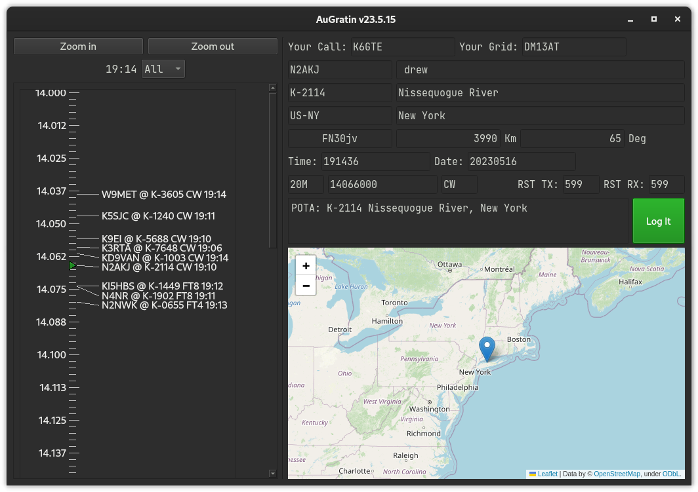

# AuGratin

    

Allows A POTA chaser to easily log contacts. Pulls latest POTA spots. Displays them in a compact interface. 

## Recent changes
https://github.com/mbridak/augratin/compare/22.6.12...master

## Features
* You can filter spots by band and or mode.
* Pulls in park and activator information.
* Tunes your radio with flrig to the activator and sets the mode automatically. 
* Double clicked spots adds Activator to a persistent watchlist.
* Displays bearing to contact.

When you press the "Log it" button the adif information is appended to `POTA_Contacts.adi` in your home folder.

## Running from source

First install the requirements.

`python3 -m pip3 install -r requirements.txt`

Or if you're the Ubuntu/Debian type you can:

`sudo apt install python3-pyqt5 python3-requests python3-psutil python3-folium`

If using a Raspberry PI, you probably need `python3-qtpy`

Then, run the program from source.

`python3 augratin.py`

## Building a binary executable

I've included a .spec file in case you wished to create your own binary from the source. To use it, first install pyinstaller.

`python3 -m pip3 install pyinstaller`

Then build the binary.

`pyinstaller --clean linux.spec`

Look in the newly created dist directory to find your binary.

Or execute the install.sh shell script in the install_icon folder to copy the binary from the dist directory to your ~/.local/bin folder and install a launcher icon.
 
